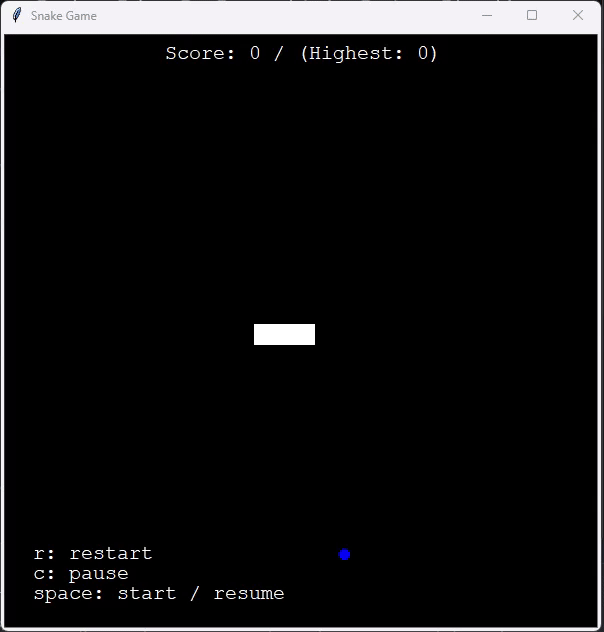

# Python Snake Game

A simple Python Snake Game using Turtle graphics.

## Functionalities
* Start, pause/resume game buttons
* Highest score
* Collision with tail
* Collision with wall

## How to play
The game requires Python 3 installed.

Clone the repo and launch the game using the following command:

```
python main.py
```

Then follow the game instruction to play.

At the end of the game, program will ask if user wants to play again or stop the game.

## Game demo



